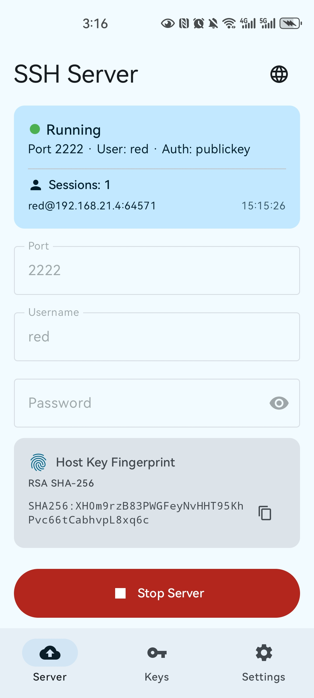
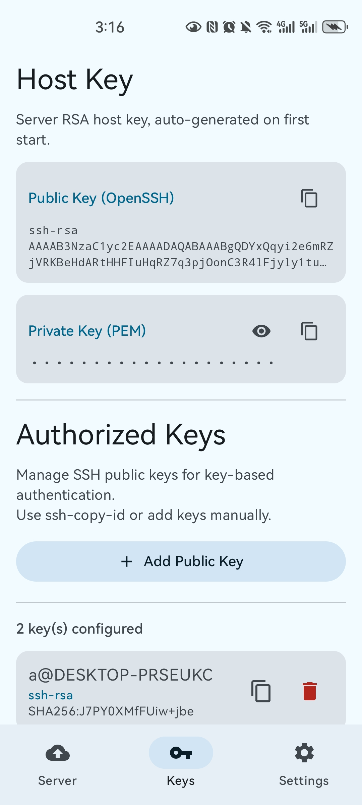
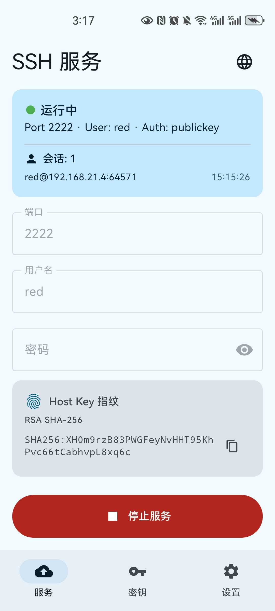
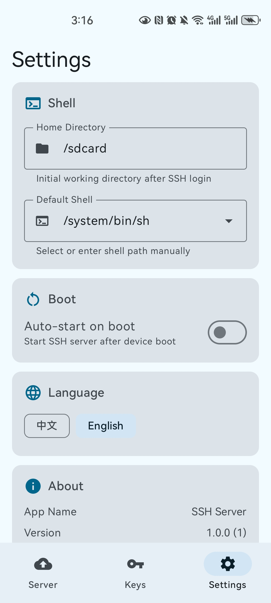
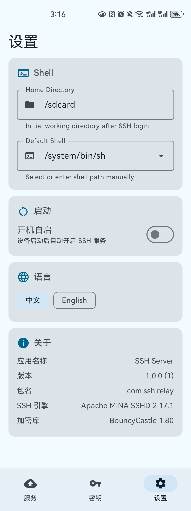

# SSH Server

[](LICENSE)
[-green.svg)](https://developer.android.com)
[](https://kotlinlang.org)
[](https://github.com/JoursBleu/ssh-server/releases)

Android SSH 服务器应用，把手机变成移动的服务器/跳板机。

[中文](#中文) | [English](#english) | [Contributing](CONTRIBUTING.md) | [Changelog](CHANGELOG.md)
---

## 中文

### 功能特性

- **SSH 服务器** — 在 Android 设备上运行完整的 SSH 服务器
- **跳板机** — 将手机作为 SSH 跳板机使用（`ssh -J`）
- **SFTP** — 内置 SFTP 子系统，支持文件传输
- **PTY** — 完整的交互式终端，原生 PTY 支持（附 ProcessBuilder 回退方案）
- **公钥认证** — 应用内管理 authorized_keys，支持 `ssh-copy-id`
- **密码认证** — 可选的密码认证（密码为空时自动禁用）
- **持久化主机密钥** — 服务器密钥生成后持久保存，重启不变
- **后台服务** — 前台服务 + WakeLock + WifiLock + NetworkCallback，切换应用或熄屏不断连
- **开机自启** — 可选设备启动后自动开启 SSH 服务
- **端口冲突恢复** — 启动时自动检测并释放残留的端口占用
- **会话追踪** — 实时显示活跃 SSH 会话，内置 keepalive
- **可配置 Shell** — 自定义 Home 目录和 Shell 路径（支持 Termux Shell）
- **中英文切换** — 运行时中英文界面即时切换
- **设置页面** — Shell 配置、开机自启、语言切换、应用信息
- **干净卸载** — 卸载时自动清除所有数据（密钥、配置、authorized_keys）

### 界面截图

<p align="center">
  
  
  
</p>
<p align="center">
  
  
  
</p>

应用包含 3 个标签页：
- **服务** — 启停服务器，绿色/灰色状态指示，活跃会话，配置项（端口/用户/密码），Host Key 指纹，语言切换
- **密钥** — 管理授权 SSH 公钥，支持添加/删除/复制，服务器密钥查看
- **设置** — Shell 路径与 Home 目录，开机自启开关，语言切换，关于信息

### 使用方法

1. 在 Android 设备上安装 APK
2. 打开应用，配置用户名/密码/端口（默认：`red` / 空 / `2222`）
3. 点击 **启动服务**
4. 从电脑连接：

```bash
# 密码认证（需设置密码）
ssh -p 2222 red@<手机IP>

# 公钥认证
ssh-copy-id -p 2222 red@<手机IP>
ssh -p 2222 red@<手机IP>

# 用作跳板机
ssh -J red@<手机IP>:2222 user@目标主机

# SFTP 文件传输
sftp -P 2222 red@<手机IP>
```

### 构建

```bash
# 构建 debug APK
./build.sh

# 构建 release APK（需要 release.keystore）
./build.sh release

# 清理
./build.sh clean
```

首次构建 release 需要生成 keystore：

```bash
keytool -genkey -v -keystore release.keystore -alias ssh-server \
  -keyalg RSA -keysize 2048 -validity 36500
```

### 技术栈

| 组件 | 版本 |
|------|------|
| Apache MINA SSHD | 2.17.1 |
| BouncyCastle | 1.80 |
| Jetpack Compose + Material 3 | BOM 2024.12.01 |
| Kotlin | 2.1.0 |
| Android SDK | 35（最低 26） |
| NDK / CMake | 27 / 3.22.1 |

### 项目结构

```
app/src/main/java/com/ssh/relay/
├── SshServerApp.kt              # 应用初始化（BouncyCastle、MINA Android 模式）
├── engine/
│   ├── SshServerEngine.kt       # SSH 服务器核心（认证、Shell、SFTP、转发、心跳）
│   ├── SshClientEngine.kt       # SSH 客户端引擎
│   ├── AuthorizedKeysManager.kt # authorized_keys 文件管理
│   └── PortChecker.kt           # 端口可用性检测与残留端口释放
├── service/
│   ├── SshServerService.kt      # 前台服务 + WakeLock/WifiLock/NetworkCallback
│   └── BootReceiver.kt          # 开机自启接收器
├── shell/
│   ├── AndroidShellFactory.kt   # Shell 工厂
│   ├── AndroidShellCommand.kt   # PTY + ProcessBuilder Shell（可配置路径）
│   ├── AndroidCommandFactory.kt # Exec 通道工厂（支持 ssh-copy-id）
│   ├── AndroidExecCommand.kt    # Exec 命令实现（路径重写）
│   └── PtyCompat.kt             # JNI PTY 桥接
├── ui/
│   ├── MainActivity.kt          # 入口 Activity（语言状态提供）
│   ├── Navigation.kt            # 3 标签页导航（服务/密钥/设置）
│   ├── ServerScreen.kt          # 服务器控制、状态、会话、指纹
│   ├── KeysScreen.kt            # 公钥管理页面
│   ├── SettingsScreen.kt        # Shell、启动、语言、关于
│   ├── Strings.kt               # 国际化字符串系统（中/英）
│   └── Theme.kt                 # Material 3 动态主题
└── cpp/
    └── pty_compat.c             # 原生 PTY（/dev/ptmx）
```

### 许可证

[Apache License 2.0](LICENSE)

---

## English

### Features

- **SSH Server** — Run a full SSH server on your Android device
- **Jump Host** — Use your phone as an SSH jump host (`ssh -J`)
- **SFTP** — Built-in SFTP subsystem for file transfer
- **PTY** — Full interactive terminal with native PTY support (with ProcessBuilder fallback)
- **Public Key Auth** — Manage authorized keys in-app, supports `ssh-copy-id`
- **Password Auth** — Optional password authentication (disabled when password is empty)
- **Persistent Host Key** — Server host key generated once and persisted across restarts
- **Background Service** — Foreground service with WakeLock + WifiLock + NetworkCallback, survives app switch and screen off
- **Boot Auto-Start** — Optionally start SSH server on device boot
- **Port Conflict Recovery** — Auto-detects and releases stale port bindings on startup
- **Session Tracking** — Real-time display of active SSH sessions with keepalive
- **Configurable Shell** — Custom home directory and shell path (supports Termux shells)
- **i18n** — Chinese / English UI with runtime language switching
- **Settings** — Shell config, boot auto-start, language switch, app info
- **Clean Uninstall** — All data (keys, settings, authorized_keys) removed on uninstall

### Screenshots

<p align="center">
  
  
  
</p>
<p align="center">
  
  
  
</p>

The app has 3 tabs:
- **Server** — Start/stop server, view status with green/gray indicators, active sessions, config (port/user/password), host key fingerprint, language switch
- **Keys** — Manage authorized SSH public keys with add/delete/copy, host key viewing
- **Settings** — Shell path & home dir, boot auto-start toggle, language switch, about info

### Usage

1. Install the APK on your Android device
2. Open the app, configure username/password/port (default: `red` / empty / `2222`)
3. Tap **Start Server**
4. Connect from your computer:

```bash
# Password auth (if password is set)
ssh -p 2222 red@<phone-ip>

# Key auth
ssh-copy-id -p 2222 red@<phone-ip>
ssh -p 2222 red@<phone-ip>

# Use as jump host
ssh -J red@<phone-ip>:2222 user@target-host

# SFTP
sftp -P 2222 red@<phone-ip>
```

### Build

```bash
# Build debug APK
./build.sh

# Build release APK (requires release.keystore)
./build.sh release

# Clean
./build.sh clean
```

To create a release keystore for the first time:

```bash
keytool -genkey -v -keystore release.keystore -alias ssh-server \
  -keyalg RSA -keysize 2048 -validity 36500
```

### Tech Stack

| Component | Version |
|-----------|---------|
| Apache MINA SSHD | 2.17.1 |
| BouncyCastle | 1.80 |
| Jetpack Compose + Material 3 | BOM 2024.12.01 |
| Kotlin | 2.1.0 |
| Android SDK | 35 (min 26) |
| NDK / CMake | 27 / 3.22.1 |

### Project Structure

```
app/src/main/java/com/ssh/relay/
├── SshServerApp.kt              # Application init (BouncyCastle, MINA Android mode)
├── engine/
│   ├── SshServerEngine.kt       # SSH server core (auth, shell, SFTP, forwarding, keepalive)
│   ├── SshClientEngine.kt       # SSH client engine
│   ├── AuthorizedKeysManager.kt # authorized_keys file management
│   └── PortChecker.kt           # Port availability check & stale port release
├── service/
│   ├── SshServerService.kt      # Foreground service with WakeLock/WifiLock/NetworkCallback
│   └── BootReceiver.kt          # Boot auto-start receiver
├── shell/
│   ├── AndroidShellFactory.kt   # Shell factory
│   ├── AndroidShellCommand.kt   # PTY + ProcessBuilder shell (configurable path)
│   ├── AndroidCommandFactory.kt # Exec channel factory (ssh-copy-id support)
│   ├── AndroidExecCommand.kt    # Exec command with path rewriting
│   └── PtyCompat.kt             # JNI PTY bridge
├── ui/
│   ├── MainActivity.kt          # Entry activity with language provider
│   ├── Navigation.kt            # 3-tab navigation (Server/Keys/Settings)
│   ├── ServerScreen.kt          # Server control, status, sessions, fingerprint
│   ├── KeysScreen.kt            # Authorized keys management
│   ├── SettingsScreen.kt        # Shell, boot, language, about
│   ├── Strings.kt               # i18n string system (Chinese/English)
│   └── Theme.kt                 # Material 3 dynamic theme
└── cpp/
    └── pty_compat.c             # Native PTY via /dev/ptmx
```

### License

[Apache License 2.0](LICENSE)
